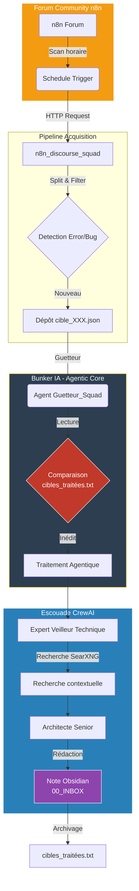

# 🛡️ ORIORIS Blueprints : Veille Agentique Automatisée (Bunker IA)


> *Infrastructure de veille agentique basée sur une architecture modulaire et locale : Détection (n8n), Raisonnement (CrewAI/LangGraph) et Persistance (Qdrant/Obsidian). Ce projet industrialise la capture et la résolution de problèmes techniques issus de forums communautaires.*

---

## 🎯 Le Cas d'Usage : "Squad Forum"

Monitorer des forums techniques (ex: communauté n8n) génère une surcharge cognitive massive. Ce système automatise la boucle de **Détection -> Analyse -> Résolution -> Documentation** directement dans un "Digital Garden" local (Obsidian).

### 🏗️ Architecture du Flux (VSL)


---
📂 Anatomie du Dépôt
L'architecture est segmentée pour garantir une isolation stricte entre l'acquisition (n8n) et l'exécution cognitive (Python).

```Plaintext
ORIORIS-Blueprints/
├── README.md                              # Ce document
├── n8n_workflows/
│   └── acquisition_discourse_forum.json   # Workflow d'acquisition sanitisé
└── bunker_agents/
    ├── squad_forum.py                     # L'escouade CrewAI (Éclaireur & Mécano)
    ├── guetteur_squad.py                  # Démon de surveillance des fichiers
    ├── agent.py                           # Cerbère d'audit d'infrastructure (LangGraph)
    ├── Dockerfile                         # Conteneurisation de l'agent
    └── requirements.txt                   # Dépendances (langchain, crewai, litellm)
```    
---    

🚀 Déploiement & Configuration
Ce système est conçu pour tourner dans un environnement Docker sécurisé, derrière un routeur LLM (LiteLLM).

```Bash
# Routage LLM (LiteLLM Local recommandé)
LITELLM_API_BASE="http://litellm_bunker:4000/v1"
LITELLM_API_KEY="votre_cle_api_securisee"
# Télémétrie
CREWAI_TELEMETRY_OPT_OUT=true
PYTHONUNBUFFERED=1
```
```Bash
cd bunker_agents
docker build -t orioris_agent_veille .
docker run -d \
  -v ./reception:/app/reception \
  -v ./obsidian:/obsidian_vault \
  --env-file .env \
  orioris_agent_veille
 ``` 
📚 Références & Standards de l'Industrie
Ce système a été conçu en s'intégrant aux standards de l'ingénierie IA 2026 :

Intégration Agentique : Inspiré de **[n8n-nodes-langchain(n8n)](https://docs.n8n.io/build/integrate-ai)**.

State Machines : Utilisation de LangGraph pour l'agent d'audit **[LangGraph (LangChain)](https://github.com/langchain-ai/langgraph)** .

Orchestration Multi-Agents : Routage via CrewAI connecté en natif à LiteLLM **[CrewAI(CrewAI)](https://github.com/crewAIInc/crewAI)**.
